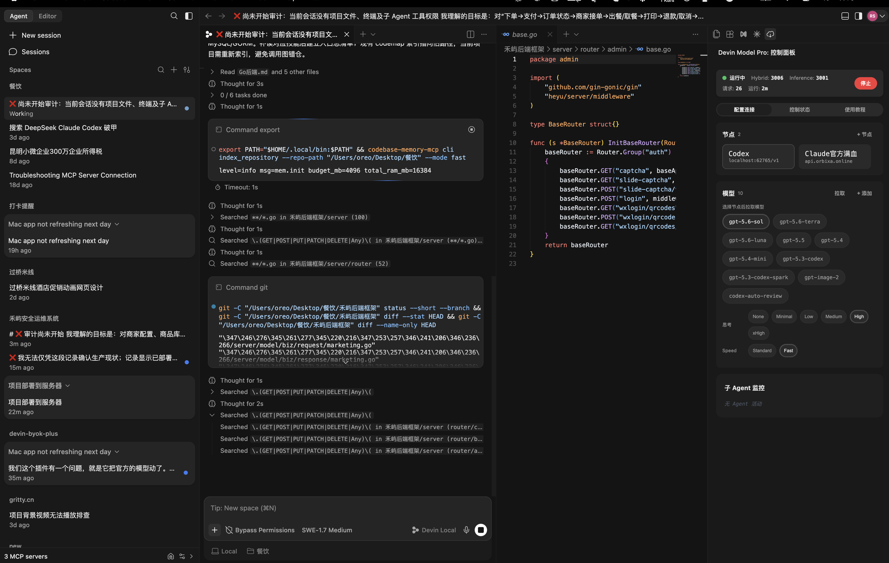

# Devin Model Pro

Devin Desktop 增强插件，让 Pro 用户能同时用官方模型和第三方模型，Free 用户用第三方模型替代官方额度。
基于最新 DevinLocal 协议，支持 Devin 全部 Agent 能力，本地执行子 Agent。
适用于 Mac，Windows 自行适配。
**完全开源** | 本地运行 | 无后端服务器

## 项目说明

这是一个 Devin Desktop 的本地代理插件，把 Devin 发出的 SWE 系列模型请求转发到你自己的 API Key，其他请求原样透传官方。

- **Pro 用户**：官方模型和第三方模型可以一起用，不用二选一。SWE 走第三方，其他走官方。
- **Free 用户**：用第三方模型替代官方额度。
- **DevinLocal 协议**：基于最新 Devin Desktop 的 DevinLocal 模式，支持 Devin 全部 Agent 能力。
- **子 Agent 本地执行**：主 Agent 派出的子 Agent 在本地跑 LLM 循环 + 工具执行，可以多个同时跑。
- **两个协议**：Claude（Anthropic）和 OpenAI。
- **节点 + 模型管理**：可配多个节点，每个节点一组 API 地址 + Key，节点下挂多个模型。

记得点个 Star，后续有空会继续维护。

## 和上游的区别

本项目 fork 自 [ycx932436/devin-byok-bridge](https://github.com/ycx932436/devin-byok-bridge)，并参考了 [jornlin/devin-byok-plus](https://github.com/jornlin/devin-byok-plus)。

感谢原作者 [@ycx932436](https://github.com/ycx932436) 打下的基础，开创了 Devin Desktop 本地代理的先河。也感谢 [@jornlin](https://github.com/jornlin) 的持续维护。

上游两个版本都是基于旧版 Windsurf 的 Cascade 模式做的，和本插件的核心区别：

| 对比项 | 上游版本 | 本插件 |
|--------|----------|--------|
| 协议模式 | 旧版 Windsurf Cascade | 最新 DevinLocal |
| Pro 用户 | 只能二选一，全官方或全第三方 | 官方和第三方可以一起用 |
| 子 Agent | 不支持 | 本地执行，支持多个并发 |
| Agent 能力 | Cascade 子集 | DevinLocal 全部 |
| 模型管理 | 槽位 | 节点 + 模型 |

## 安装

在 Devin Desktop / VS Code 中：

1. `Ctrl+Shift+P` → **Extensions: Install Extension from Location...**
2. 克隆或下载本仓库，选择仓库根目录

若已打包 VSIX，也可用 **Install from VSIX...**。

## 快速开始

1. 点击左侧 **Devin Model Pro** 图标打开控制面板
2. 在 **配置连接** Tab 点 **+ 节点** 添加一个节点，填第三方 API 的地址和 Key
3. 选中节点后点 **拉取** 加载模型列表，选你要用的模型
4. （可选）从 **Protocol** 下拉手动选 anthropic / openai，空值自动按模型名识别
5. 点顶部 **启动** 按钮
6. 在 **控制状态** Tab 点 **安装补丁**，把 Devin 内部 API 指向本代理
7. 重载窗口生效

> 配置字段输入后自动保存，不用手动点保存按钮。

## 使用教程

侧栏第三个 Tab **使用教程** 里有完整操作流程，主要几步：



1. **运行模式**：只支持 DevinLocal 模式。在 Devin 输入框底部把模式切到 DevinLocal，请求才会走本代理。Free 账号和 Pro 账号都能用。
2. **SWE 系列模型**：SWE 全系列模型都会自动走你配置的第三方 API 模型，不用单独配。支持的标识：
   - `swe-1-6` / `swe-1-6-medium` / `swe-1-6-fast`
   - `swe1.6` / `swe-1.6`
   - `swe-1-7` / `swe-1-7-medium` / `swe-1-7-max`
3. **填配置**：在配置连接 Tab 点 + 节点添加一个节点，填第三方 API 的地址和 Key，选中节点后点拉取加载模型列表，选你要用的模型。
4. **装补丁**：在控制状态 Tab 点安装补丁，把 Devin 内部 API 指向本代理。装完重载窗口生效。
5. **启动代理**：点顶部启动按钮。运行后日志显示在控制状态 Tab。

## 工作原理

代理拦截 Devin Desktop 发出的请求，按模型名分流：

- **SWE 系列模型**（`swe-1-6` / `swe-1-7` 及所有变体）→ 走你配置的第三方 API
- **其他所有请求**（官方 Claude / GPT / 搜索 / Embeddings 等）→ 原样透传 Devin 官方

这样 Pro 用户可以同时用官方模型和第三方模型：官方模型走官方额度，SWE 走你自己的 Key。

## 子 Agent

Devin 主 Agent 派出的子 Agent 会在本地执行，跑一个 LLM 循环 + 工具调用，复用主 Agent 的工具定义和你的模型配置。

- **subagent_explore**：只读探索模式，用 grep / glob / read / web_search
- **subagent_general**：完整工具访问，能读写文件、跑命令
- 支持多个子 Agent 同时跑
- 子 Agent 结果会回传给主 Agent

## 节点与模型

用节点 + 模型方式管理第三方 API。一个节点 = 一组 API 地址 + Key，节点下可以挂多个模型。

- 点 **+ 节点** 添加节点，填 Base URL 和 API Key
- 选中节点后点 **拉取** 从该节点加载可用模型列表
- 选要用的模型，Devin 发请求时按模型名识别走哪个节点
- 可配多个节点，分别指向不同网关或不同厂商

## 思考强度

切换模型后下拉选项按厂商自动变化，档位 `low` / `medium` / `high` / `xhigh` / `max`。

- Claude 新模型走自适应思考 + effort 参数
- Claude 旧模型走固定思考预算
- GPT 走 `reasoning.effort`，默认用 Responses API，不支持时自动回退到 Chat Completions
- Claude 多轮历史里没签名的思考块默认会被剔除，避免报 `signature: Field required`

## 系统提示词清洗

代理会自动清理 Devin 发来的系统提示词里的伪造身份指令，包括：

- "You are Cascade..."
- "driven by Cognition's SWE-x.x..."
- "If asked who you are, answer Cascade..."

避免第三方模型被误导成 Cascade 身份。

## 平台支持

- **Mac**：原生支持，作者 anna 在 Mac 上开发和测试
- **Windows**：作者没有 Windows 设备，未做适配。改动不大，主要是补丁路径和进程管理几个地方，自行改改即可
- **Linux**：未测试，理论可用

## 环境变量

插件会自动写入 `proxy-scripts/.env`（已被 `.gitignore` 排除，不会上传）。想手动改参考 `proxy-scripts/.env.example`。

节点配置（n = 1..4，按节点顺序）：

```
BYOKn_ANTHROPIC_API_HOST=
BYOKn_ANTHROPIC_API_KEY=
BYOKn_OPENAI_API_HOST=
BYOKn_OPENAI_API_KEY=
BYOKn_OPENAI_SERVICE_TIER=    # fast 或空，OpenAI 优先级通道
BYOKn_MODEL=
BYOKn_THINKING_EFFORT=        # low | medium | high | xhigh | max
BYOKn_PROTOCOL=               # anthropic | openai | 空（自动识别）
```

通用：

```
HYBRID_PORT=3006              # 聊天代理端口
INFERENCE_PORT=3001           # 补全代理端口
MAX_TOKENS=64000
ADMIN_TOKEN=                  # 可选，设了之后改配置要带这个 token
```

可选：

- `STRIP_UNSIGNED_THINKING=false` — 保留没签名的 Claude 思考块
- `GATEWAY_CAPABILITY_TTL_MS=3600000` — 网关能力缓存时间
- `VOYAGE_API_KEY=` — Embeddings 走 Voyage 时需要
- `PROMPT_CACHE_ENABLED=true` — Prompt Cache 总开关
- `ANTHROPIC_PROMPT_CACHE=true` — Claude 请求打缓存断点
- `OPENAI_PROMPT_CACHE=observe` — GPT 前缀缓存模式

## 打包

```bash
npm run build
npm run package
```

生成 `devin-model-pro-{version}.vsix`，拖进 Devin Desktop 或 `code --install-extension` 安装。

## 已知限制

- 代码补全只走 Anthropic 通道，暂不支持 GPT 补全
- GPT 没有独立的 Devin 入口，要在节点模型里选 GPT 模型
- 你的 API 网关要支持对应接口：Claude `/v1/messages`；GPT 优先 `/v1/responses`，不支持时回退 `/v1/chat/completions`

## 常见问题

**补丁失效**：Devin Desktop 更新后重新安装补丁并重载窗口。

**端口占用**：改代理端口后重启代理。

**启动失败**：检查 Node.js、API Key、侧栏日志。

**模型列表加载失败**：检查 Key、余额、网络，确认网关兼容。

**思考无效果**：确认强度没选关闭，Claude 新模型要网关支持自适应思考。

**Bedrock 报 `signature: Field required`**：历史消息里有没有签名的思考块，默认会自动剔除；还失败就新开对话。

**GPT 报 `convert_request_failed`**：网关不支持 `/v1/responses`，代理会自动回退；还失败就在高级路由里手动设 OpenAI API Path。

## 免责声明

本项目仅供学习和研究使用，不得用于商业用途。

- **风险自负**：使用本工具产生的一切后果由使用者自行承担
- **无担保**：本项目按"原样"提供，不提供任何明示或暗示的担保
- **无关联**：本项目与 Devin / Cognition / Codeium / Windsurf 官方无任何隶属或授权关系
- **合规风险**：使用本工具可能违反 Devin / Codeium 的服务条款，请自行评估风险
- **数据安全**：本工具不收集任何用户数据，API Key 和配置仅存储在本机

「安装补丁」会直接修改 Devin Desktop 内置 `extension.js`，IDE 升级后补丁可能失效，安装前会自动备份原文件（`.devin-bak`）。

本地代理默认监听 `127.0.0.1`，请勿把端口暴露到公网。

## License

MIT License
